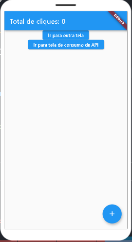
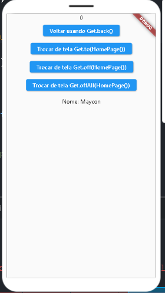
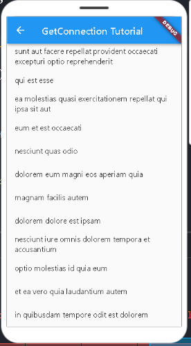

# Aprendendo Getx

Aprendendo Getx, com arquitetura MVC e Requisição de API com GetConnect.

## Getting Started

- [Lab: Write your first Flutter app](https://flutter.dev/docs/get-started/codelab)
- [Cookbook: Useful Flutter samples](https://flutter.dev/docs/cookbook)
- [Online documentation](https://flutter.dev/docs)

- [Plataforma que utilizo para codar: FlutLab.io](https://flutlab.io)

